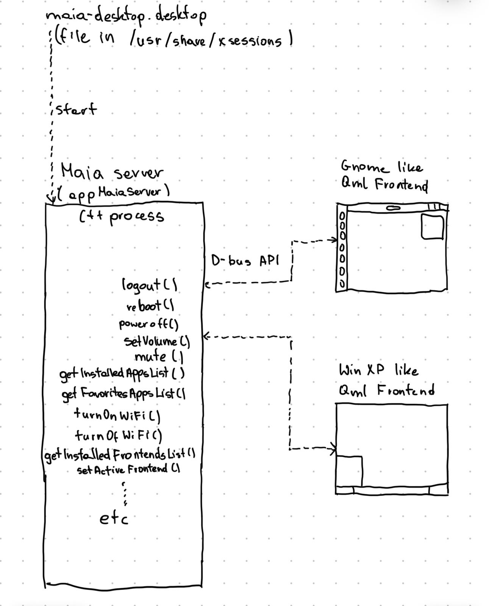
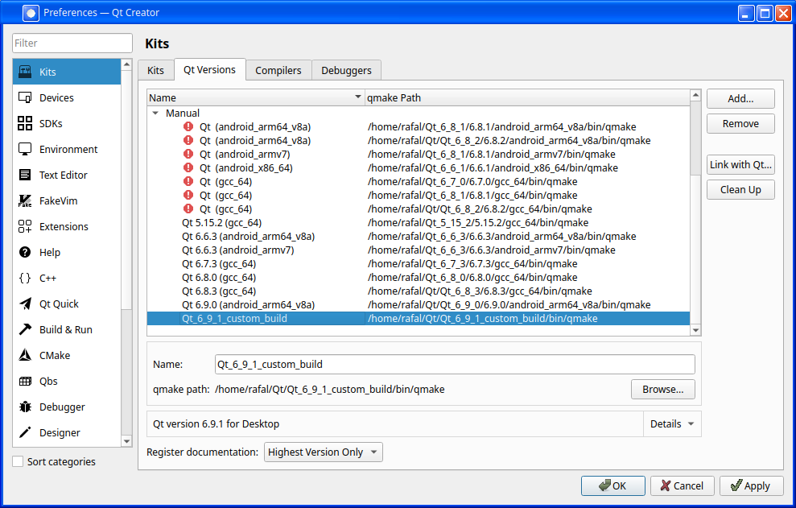
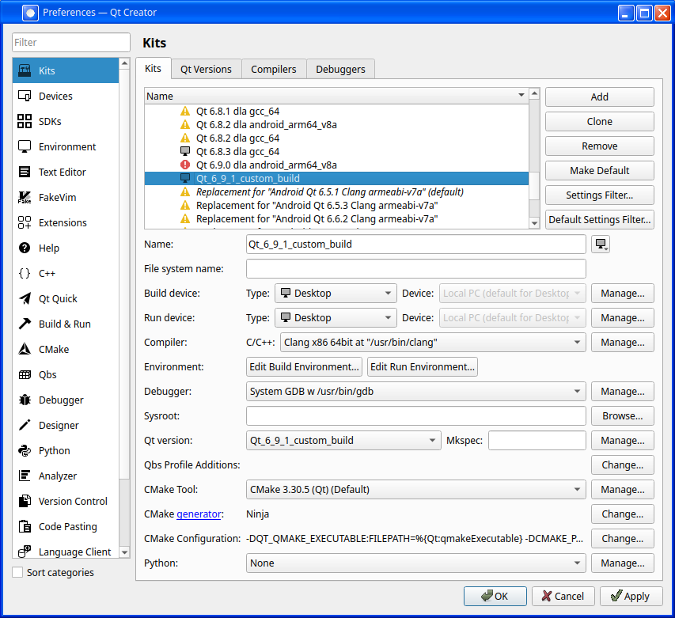
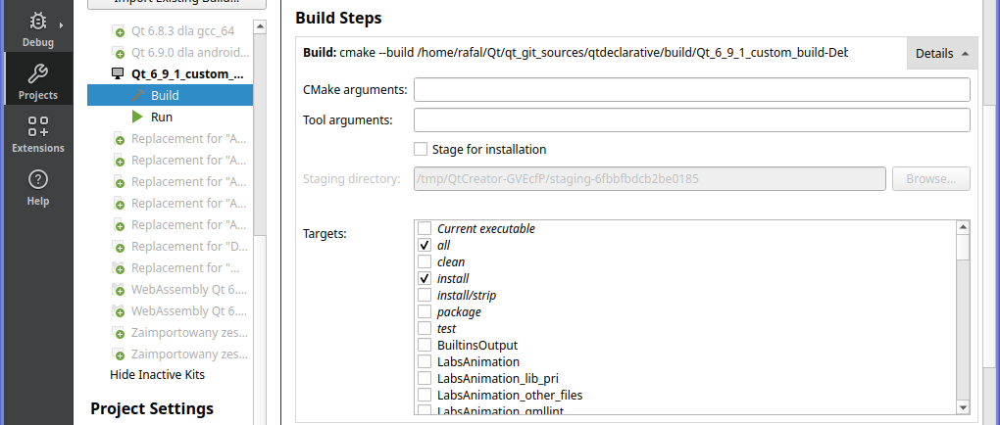

# Maia Shell

## Overview

Maia Shell is a lightweight, modular graphical shell for Linux, built with C++ and QML. It features a unique split architecture, inspired by web technologies, separating the backend from the frontend. With Maia Shell, you can seamlessly switch between different frontend designs, such as Windows XP-inspired or GNOME-like layouts, all connected to a single, robust backend.

## Limitations

Maia Shell is an experimental proof-of-concept project. It supports basic functionality, including launching applications, managing a favorites list, session control (logout, reboot, shutdown), volume control, muting, and a functional taskbar. However, many features are not yet implemented, such as wallpaper settings, Wi-Fi and Bluetooth management. It currently supports only single-monitor setups and has been tested solely at FHD (1920x1080) resolution. This shell is ideal for enthusiasts who enjoy experimenting with early-stage software, but it is not a production-ready desktop environment.

## Maia Shell in action


## Instalation

To install Maia Shell on Ubuntu, follow these steps:

1. **Install dependencies:**

```bash
sudo apt install --no-install-recommends --no-install-suggests kwin-x11
sudo apt install --no-install-recommends --no-install-suggests kwin-common
sudo apt install --no-install-recommends --no-install-suggests kwin-data
sudo apt install --no-install-recommends --no-install-suggests kwin-addons
sudo apt install --no-install-recommends --no-install-suggests libkf5globalaccel-bin breeze libkf5kcmutils5
```
2. **Download and install:**
	* Download the latest release package from GitHub.
	* Unzip the package and navigate to the extracted directory.
	* Run the installation script:

```bash
chmod +x install_on_ubuntu.sh
sudo ./install_on_ubuntu.sh
```

3. **Start Maia Shell:**
	- Log out of your current session.
	- Select the "Maia" session from your login manager and log in.
	
	
	
## Basic Architecture




# Contributing

sudo nano /usr/share/xsessions/maia_version-desktop.desktop

sudo apt update
sudo apt install snapd
sudo snap install kf6-core22


How to run Qt Wayland examples (minimal-qml example) under console
1. Ctrl + Alt + F5 - login to console
2. Go to minimal-qml executable
3. Set debug enviroment variable export QT_QPA_EGLFS_DEBUG=1
4. Set login category export QT_LOGGING_RULES="qt.qpa.input=true"
5. Set enviroment variable export QT_QPA_PLATFORM=eglfs
6. Add user to input group sudo usermod -aG input your_user_name
7. Run minimal-qml ./minimal-qml
8. Run sample app: qterminal --platform wayland
(If you are on the console and have the problem that the keyboard, mouse etc.
don't work (which should be fixed in Qt 5.6 and above, theoretically) you can
try various input plugins (after rebooting via ssh, or the power button ;-) by adding
```-plugin EvdevTouch -plugin EvdevMouse -plugin EvdevTablet -plugin EvdevKeyboard```
or
```-plugin libinput```)


How to run qt wayland fancy-compositor example:
1. configure project
2. in project run configuration set enviroment variable: WAYLAND_DISPLAY=wayland-1 and start example
3. open terminal , in new tab set enviroment varialbe WAYLAND_DISPLAY=wayland-1
4. run test application: eg gnome-calculator 


How to run apps under qtCreator Wayland Compositor, (fancy-compositor):


export WAYLAND_DISPLAY=wayland-0 &&
export XDG_RUNTIME_DIR=/run/user/1000 &&
export XDG_SESSION_TYPE="wayland"

1. Non QtApps:
WAYLAND_DISPLAY=wayland-0 XDG_RUNTIME_DIR=/run/user/1000 XDG_SESSION_TYPE="wayland" firefox

2. QtApps:
qterminal -platform wayland

3. QtApps second way:
WAYLAND_DISPLAY=wayland-0 XDG_RUNTIME_DIR=/run/user/1000 XDG_SESSION_TYPE="wayland" qterminal

4. Run google-chrome under weaston wayland
google-chrome-stable --enable-features=UseOzonePlatform --ozone-platform=waylan


Jak uruchomić kompilacje projektu z zależnościami
find_package(KF6WindowSystem ${KF6_MINIMUM_VERSION} REQUIRED)
target_link_libraries(${PROJECT_NAME} PRIVATE KF6::WindowSystem)

1. Skompilować KDE (wg instrukcji ze strony)
2. Wyszukać lokalizacje pliku KF6WindowSystemConfig.cmake
3. Znalezione zostana dwie lokalizacje, wybrać ta z plikiem KF6WindowSystemTargets.cmake
4. Dodać zmienna KF6WindowSystem_DIR = /home/john/kde/usr/lib/x86_64-linux-gnu/cmake/KF6WindowSystem do Wstepnej konfiguracji i do Bieżacej konfiguracji
5. Skompilować projekt


Instalacja KDE/extra-cmake-modules (zależność do KDE / Nitrux/maui-core)

1. export PATH=/home/john/Qt_6_8_0/Tools/CMake/bin:$PATH
1. git clone --recurse-submodules https://github.com/KDE/extra-cmake-modules.git
2. cd extra-cmake-modules/
3. git fetch --tags
4. git checkout v6.8.0
5. mkdir build && cd build
6. cmake .. -DCMAKE_INSTALL_PREFIX=/.local
7. make
8. sudo make install


Build KDE workspace

1. export PATH=/home/john/Qt_6_8_0/Tools/CMake/bin:$PATH
2. export PATH=/home/john/Qt_6_8_0/6.8.0/gcc_64/bin:$PATH
3. qmake --version
4. kde-builder workspace


ERROR, gdy pojawi sie ten error, to trzeba sprawdzić czy wersja ECM pasuje do wersji Qt:
CMake Error at /home/john/kde/usr/share/ECM/modules/ECMQmlModule6.cmake:24 (qt6_policy):
  Unknown CMake command "qt6_policy".
Call Stack (most recent call first):
  /home/john/kde/usr/share/ECM/modules/ECMQmlModule.cmake:184 (include)
  CMakeLists.txt:30 (include)
-- Configuring incomplete, errors occurred!


zmienne środowiskowe do ustawienia:

export PATH=/home/john/Qt_6_8_0/Tools/CMake/bin:$PATH
export PATH=/home/john/Qt_6_8_0/6.8.0/gcc_64/bin:$PATH

export KF6Notifications_DIR="/home/john/kde/usr/lib/x86_64-linux-gnu/cmake/KF6Notifications"
export KF6CoreAddons_DIR="/home/john/kde/usr/lib/x86_64-linux-gnu/cmake/KF6CoreAddons"
export KF6I18n_DIR="/home/john/kde/usr/lib/x86_64-linux-gnu/cmake/KF6I18n"
export KF6WindowSystem_DIR="/home/john/kde/usr/lib/x86_64-linux-gnu/cmake/KF6WindowSystem"
export KF6KIO_DIR="/home/john/kde/usr/lib/x86_64-linux-gnu/cmake/KF6KIO"


//ustawienie tego sprawia ze cmake widzi wszystkie bybloteki KDE !!!!!!!!!!!!!!!
export CMAKE_PREFIX_PATH="/home/john/kde/usr/lib/x86_64-linux-gnu/cmake:$CMAKE_PREFIX_PATH"
export CMAKE_PREFIX_PATH="/home/john/kde/usr/lib/cmake:$CMAKE_PREFIX_PATH"   //To resolve error: Could not find a package configuration file provided by "PolkitQt6-1"


kde-builder kpeople

kde-builder akonadi
kde-builder akonadi-calendar
kde-builder akonadi-search
kde-builder pulseaudio-qt


sudo apt install libsecret-1-dev (Fix Error: kde-builder akonadi-calendar: <<<  PACKAGES FAILED TO BUILD  >>> qtkeychain)
sudo apt install libxapian-dev (Fix Error: kde-builder akonadi-search: Unable to configure akonadi-search with KDE CMake


## D-bus commands

- get power profiles:
```console
dbus-send --system --print-reply --dest=org.freedesktop.UPower.PowerProfiles /org/freedesktop/UPower/PowerProfiles org.freedesktop.DBus.Properties.Get string:org.freedesktop.UPower.PowerProfiles string:Profiles
```

- show current power profile (powerprofilesctl get): 
```bash
dbus-send --system --print-reply --dest=org.freedesktop.UPower.PowerProfiles /org/freedesktop/UPower/PowerProfiles org.freedesktop.DBus.Properties.Get string:org.freedesktop.UPower.PowerProfiles string:ActiveProfile
```
### KWIN dbus commands


//reconfigure - reload theme after change window decoration
qdbus org.kde.KWin /KWin org.kde.KWin.reconfigure

//showDesktop(true) - show desktop method
qdbus org.kde.KWin /KWin org.kde.KWin.showDesktop true

//turn off composition
qdbus org.kde.KWin /Compositor suspend
//turn on composition
qdbus org.kde.KWin /Compositor resume

qdbus org.kde.KWin /KWin org.kde.KWin.queryWindowInfo
qdbus org.kde.KWin /KWin org.kde.KWin.cascadeDesktop

//get support information
qdbus org.kde.KWin /KWin org.kde.KWin.supportInformation

qdbus org.kde.KWin /KWin org.kde.KWin.queryWindowInfo
qdbus org.kde.KWin /Effects org.kde.kwin.Effects.isEffectLoaded blur

qdbus org.kde.KWin /Effects org.freedesktop.DBus.Properties.GetAll org.kde.kwin.Effects

//enable wobblywindows
qdbus org.kde.KWin /Effects org.kde.kwin.Effects.loadEffect wobblywindows

//loaded effects property
qdbus org.kde.KWin /Effects org.freedesktop.DBus.Properties.Get org.kde.kwin.Effects loadedEffects

//unload effect
qdbus org.kde.KWin /Effects org.kde.kwin.Effects.unloadEffect kscreen

//unload effect_scale
qdbus org.kde.KWin /Effects org.kde.kwin.Effects.unloadEffect kwin4_effect_scale

//unload popups fading effect
qdbus org.kde.KWin /Effects org.kde.kwin.Effects.unloadEffect kwin4_effect_fadingpopups

//load popups fading effect
qdbus org.kde.KWin /Effects org.kde.kwin.Effects.loadEffect kwin4_effect_fadingpopups

## Kmix

//build kmix
kde-builder kmix

//run kmix
kde-builder --run kmix

//get kmix mixers
qdbus org.kde.kmix /Mixers org.freedesktop.DBus.Properties.Get org.kde.KMix.MixSet mixers

//build kmix fork
1. git clone https://github.com/KDE/kmix.git ~/kde/src/kmix-fork
2. nano ~/.config/kde-builder.yaml
3. add lines:
project kmix-fork:
  no-src: true
4. export PATH=/home/john/Qt_6_8_0/Tools/CMake/bin:$PATH
5. export PATH=/home/john/Qt_6_8_0/6.8.0/gcc_64/bin:$PATH
6. kde-builder kmix  //build oryginal to build dependencies
6. kde-builder kmix-fork //build fork


Dependencies:
1. kwin
2. oxygen icon theme
3. qterminal
4. pcman-qt
5. qdbus


export PATH=/home/john/Qt/Qt_6_8_2/Tools/CMake/bin:$PATH
export PATH=/home/john/Qt/Qt_6_8_2/6.8.2/gcc_64/bin:$PATH


# Linux qt and gtk apps look customization

~/.config/gtk-3.0/settings.ini
~/.config/gtk-4.0/settings.ini

qt qml style:

export QT_QUICK_CONTROLS_STYLE=Basic
export QT_QUICK_CONTROLS_STYLE=Material

QT_STYLE_OVERRIDE

export QT_STYLE_OVERRIDE="Breeze"
export QT_STYLE_OVERRIDE="Windows"
export QT_STYLE_OVERRIDE="Fusion"
export QT_STYLE_OVERRIDE=Breeze


QT_QPA_PLATFORMTHEME

To change qt app apperance eg. pcmanfm-qt, qterminal use qt5ct app
and set enviroment variable
export QT_QPA_PLATFORMTHEME=qt5ct

# Run Maia in Xephyr

```console
DBUS_SESSION_BUS_ADDRESS=unix:path=/tmp/maia-dev-dbus.sock dbus-run-session Xephyr :1 -screen 1280x720 -ac &
```

Run -> Add.. -> Custom Executable

Executable: dbus-run-session
Command Line Arguments: /home/tom/Maia/build/Desktop_Qt_6_9_1-Debug/MaiaServerApp/appMaiaServer
Working Directory: /home/tom/Maia/build/Desktop_Qt_6_9_1-Debug/MaiaServerApp

Set in QtCreator Run Enviroment Variables:
DISPLAY=:1
DBUS_SESSION_BUS_ADDRESS=unix:path=/tmp/maia-dev-dbus.sock


# Add Maia to Display Manager

```console
sudo nano /usr/share/xsessions/maia_version-desktop.desktop
```

# Build Qt6 from sources

## Build Qt6

```console
apt install \
    libfontconfig1-dev \
    libfreetype-dev \
    libgtk-3-dev \
    libx11-dev \
    libx11-xcb-dev \
    libxcb-cursor-dev \
    libxcb-glx0-dev \
    libxcb-icccm4-dev \
    libxcb-image0-dev \
    libxcb-keysyms1-dev \
    libxcb-randr0-dev \
    libxcb-render-util0-dev \
    libxcb-shape0-dev \
    libxcb-shm0-dev \
    libxcb-sync-dev \
    libxcb-util-dev \
    libxcb-xfixes0-dev \
    libxcb-xkb-dev \
    libxcb1-dev \
    libxext-dev \
    libxfixes-dev \
    libxi-dev \
    libxkbcommon-dev \
    libxkbcommon-x11-dev \
    libxrender-dev
cd ~
mkdir ~/Qt/qt_git_sources/
cd ~/Qt/qt_git_cources/
git clone --recurse-submodules  --branch v6.9.1 https://code.qt.io/qt/qt5.git .
./configure -init-submodules

git clean -d -f -x && git reset --hard HEAD //clean all untracket files and directories

mkdir qt-build/
cd qt-build/

../configure -help
../configure -list-features
../configure -no-feature-accessibility
../configure -release -opensource -confirm-license -prefix /home/john/Qt/Qt_6_9_1_custom_build/

cmake --build . --parallel
cmake --install .
```

## Prepare QtCreator to use custom Qt





## Develop Qt module

To begin, launch Qt Creator and navigate to the project for the Qt module. Open the CMakeLists.txt file corresponding to the module and proceed to configure the project to use your custom-built Qt kit.

Set install dir in Projects->Build & Run -> Build -> Build Settings -> Current Configuration -> CMAKE_INSTALL_PREFIX = /home/john/Qt/Qt_6_9_1_custom_build

If you require the library to be installed upon completion of the build process, enable the 'install' target by checking the corresponding box in the build steps. You can find this option under: Projects -> Active Project -> Build -> Build Steps -> Targets -> install.




